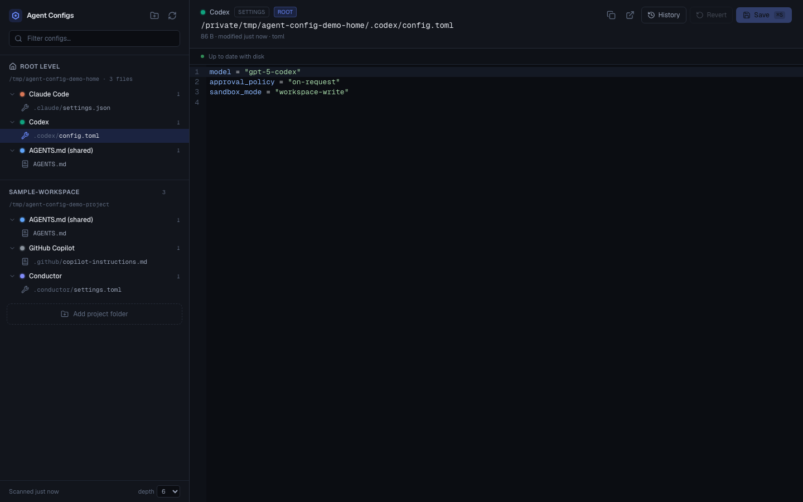

# Agent Configs

A local dashboard for every coding-agent configuration on this machine: the
root-level ones under `~`, plus any project folders you point it at.

Runs on your machine only — it reads and writes real files on disk and has no
auth, so do not expose it to a network.

## Screenshot

The screenshot below uses sample data only.



## Run it

```bash
pnpm install
pnpm dev
```

Then open <http://localhost:4321>.

## Start at Login

On macOS, install a user LaunchAgent so the dashboard starts automatically when
you log in:

```bash
pnpm autostart:install
```

The installer builds the app, starts it on <http://localhost:4321>, and writes
logs to `~/Library/Logs/agent-config-dashboard/`.

Useful commands:

```bash
pnpm autostart:status
pnpm autostart:uninstall
```

## What it shows

**Root level** — configuration under your home directory, grouped by agent:

| Agent | Examples |
| --- | --- |
| Claude Code | `~/.claude/CLAUDE.md`, `~/.claude/settings.json`, `~/.claude.json`, subagents, commands, skills, hooks |
| Codex | `~/.codex/config.toml`, prompts, skills |
| Pi | `~/.pi/agent/AGENTS.md`, `settings.json`, `models.json`, `trust.json` |
| AGENTS.md (shared) | `~/AGENTS.md`, `~/.agents/skills/*/SKILL.md` — the cross-vendor standard |
| Gemini, Cursor, Copilot, Aider, Amp, opencode, Crush, Goose, Conductor, Windsurf, Cline, Roo, Kiro, Junie, Qwen | settings, rules, MCP configs, skills |

Files that do not exist are never listed, so the sidebar only shows what you
actually have. The full registry lives in `lib/agents.ts` — add a pattern there
to teach the dashboard about another agent.

**Projects** — folders you add yourself. They do **not** need to be git repos.
Each one is searched recursively, so a `CLAUDE.md` at the root and a
`.claude/settings.local.json` six folders down both show up, labelled with their
path. `node_modules`, `.git`, build output and friends are skipped. Use the
**depth** control in the footer to widen or narrow the search.

## Editing

Click any file to open it in a syntax-highlighted editor. `⌘S` or the Save
button writes it.

- **JSON, JSONC, TOML and YAML are parsed before anything touches disk.** A
  syntax error shows in the status bar and the save is refused, so a bad edit
  cannot break an agent's config.
- Writes go to a temp file and are then renamed, so an interrupted save cannot
  leave a truncated config behind.
- If the file changed on disk since you opened it, the save stops and offers to
  overwrite rather than silently clobbering the other change.
- Writing bytes identical to what is already on disk is a no-op, so nothing is
  touched and no version is recorded.

## Version history

Every save records the content it replaced. Open **History** in the editor
toolbar to see them, newest first, with the size difference against what is on
disk now.

Selecting a version shows a diff rather than dropping you into raw text: green
is what restoring would add, red what it would remove. **Restore this version**
then writes it back.

A restore is itself a save, so the content it replaced is added to the history
too — rolling back is always undoable. Restores skip syntax validation on
purpose: a version is a byte-exact record of what was on disk, and the point of
restoring is to get exactly that back.

Up to 50 versions are kept per file, under `data/versions/<name>-<hash>/`, one
file per version named after its timestamp. The trash icon in the History panel
discards a file's history without touching the file.

## Safety

- Reads and writes are restricted to your home directory and the project folders
  you registered. Anything else is rejected, including symlinks that try to hop
  outside and `../` traversal.
- Credential files are refused outright — `auth.json`, `.credentials.json`,
  `oauth.json`, `.env*`, `*.pem`, `*.key`, and anything under `.ssh`, `.gnupg`
  or `.aws`. They are not listed and cannot be read or written.
- Files over 2 MB and binary files open read-only.

## Layout

```
app/api/snapshot   scan everything, grouped by scope and agent
app/api/file       read / write a single config
app/api/projects   add, remove and configure project folders
app/api/versions   list, read and restore stored versions
app/api/browse     directory listing for the folder picker
app/api/reveal     reveal a file in Finder
lib/agents.ts      the agent registry — which globs belong to which agent
lib/scan.ts        globbing, symlink de-duplication, subfolder attribution
lib/fileio.ts      validate, snapshot, atomic write, restore
lib/versions.ts    version storage, listing, pruning
lib/paths.ts       path allow-listing and credential-file refusal
data/              registered projects and stored versions (gitignored)
```

## Notes

Several agents symlink a shared skills directory (`~/.agents/skills`) into their
own config folder. Each file is listed once at its real location; the editor
header names the other agents that link to it.
